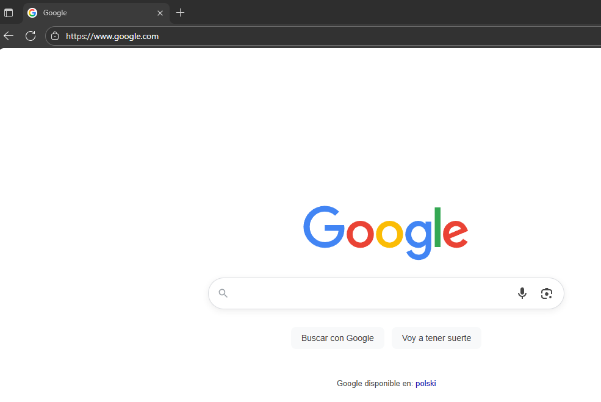

# 🔍 Laboratorio de Análisis de Seguridad: IP Tracker con Redirección Invisible

## 📖 Introducción

**En este taller aprenderemos a configurar un sistema de tracking de IPs** que demuestra cómo se puede recopilar información de usuarios a través de un enlace aparentemente inofensivo. El laboratorio incluye la instalación de un servidor web local, desarrollo de un script PHP personalizado para capturar datos, exposición controlada a internet mediante tunneling con Ngrok, análisis de la información obtenida y evaluación de medidas de protección contra este tipo de técnicas.

**Este laboratorio se ha realizado en un entorno completamente controlado y aislado** con fines exclusivamente educativos. Todas las pruebas se ejecutaron mediante:

- 🔒 **VPN activada** para proteger mi identidad y ubicación real
- 💻 **Máquinas virtuales** con sistemas operativos Kali Linux y Ubuntu  
- 🛡️ **Redes aisladas** sin conexión a mis sistemas personales
- 📋 **Protocolos de seguridad** para evitar cualquier fuga de datos

El objetivo es concienciar sobre los riesgos de hacer clic en enlaces no verificados y demostrar la importancia de implementar medidas de seguridad adecuadas, **nunca para actividades maliciosas**.

## 📑 Índice del Laboratorio

1. [🔧 Configuración del Entorno](#-configuración-del-entorno)
2. [⚙️ Script de Automatización](#-script-de-automatización)  
3. [🐘 Explicación del Código PHP](#-explicación-del-código-php)
4. [🌐 Configuración de Ngrok](#-configuración-de-ngrok)
5. [🎯 Ejecución del Laboratorio](#-ejecución-del-laboratorio)
6. [📊 Captura y Análisis de Datos](#-captura-y-análisis-de-datos)
7. [⚠️ Análisis de Seguridad](#-análisis-de-seguridad)
8. [🛡️ Recomendaciones de Protección](#-recomendaciones-de-protección)

## 🔧 Configuración del Entorno

### Requisitos Previos
- Máquina virtual con Linux (Kali/Ubuntu)
- Conexión VPN activada
- Acceso con privilegios de administrador
- Conexión a internet para descargas

## ⚙️ Script de Automatización

Para agilizar la preparación del laboratorio, desarrollé un script de automatización que realiza toda la configuración necesaria.

[Ver script completo de preparación](preparacion.sh)

**¿Qué hace el script?**
1. ✅ Limpia el directorio web existente
2. ✅ Instala Apache y PHP si no están presentes  
3. ✅ Configura los permisos adecuados para los archivos
4. ✅ Crea el archivo de logs con los permisos correctos
5. ✅ Reinicia el servicio Apache para aplicar los cambios

**Ejecución:**
```bash
chmod +x preparacion.sh
sudo ./preparacion.sh
```


*Configuración de permisos para los archivos del sistema - Como se observa en la imagen, es necesario crear el archivo index.php en el directorio /var/www/html/ y copiar el contenido del script PHP desarrollado para este laboratorio. Además, se deben configurar los permisos adecuados (chown www-data:www-data y chmod 644) para garantizar el correcto funcionamiento del sistema de tracking.*

## 🐘 Explicación del Código PHP

El corazón del laboratorio es un script PHP que desarrollé específicamente para este proyecto.

[Ver código PHP completo](index.php)

**Funcionalidades clave:**

### 1. Detección Avanzada de IP
```php
// Detecta la IP real incluso detrás de proxies y Cloudflare
function get_client_ip() {
    $headers = ['HTTP_CF_CONNECTING_IP', 'HTTP_X_REAL_IP', 'HTTP_X_FORWARDED_FOR'];
    foreach ($headers as $header) {
        if (!empty($_SERVER[$header])) {
            return $_SERVER[$header];
        }
    }
    return $_SERVER['REMOTE_ADDR'];
}
```

### 2. Geolocalización Precisa
Consulta la API de ip-api.com para obtener:
- País y ciudad exactos
- Coordenadas geográficas
- Proveedor de internet (ISP)

### 3. Registro Estructurado
Guarda todos los datos en formato legible con timestamp exacto

### 4. Redirección Transparente
Después de capturar los datos, redirige inmediatamente a Google

## 🌐 Configuración de Ngrok

Para exponer el servidor local de forma segura, utilicé Ngrok en su versión gratuita.

### 1. Registro en Ngrok
Primero es necesario crear una cuenta gratuita en [ngrok.com](https://ngrok.com/)


*Formulario de registro en la página oficial de Ngrok*

### 2. Obtención del Token
Después del registro, se obtiene un token de autenticación único:

```bash
# Configurar el token en el sistema
ngrok config add-authtoken [TU_TOKEN_AQUI]
```


*Autenticación exitosa con el token proporcionado*

### 3. Exposición del Servidor
Con el token configurado, exponemos el puerto 80:

```bash
ngrok http 80
```


*Tunnel activo mostrando las estadísticas de conexión*

## 🎯 Ejecución del Laboratorio

### Enlace Generado
Ngrok proporciona un enlace único tipo:
```
https://abcd1234.ngrok-free.app
```

### Advertencia de Seguridad
Al ser plan gratuito, los usuarios ven una advertencia:


*Página de advertencia que muestra Ngrok para cuentas gratuitas*

El usuario debe hacer clic en "Visit Site" para continuar.

**Nota importante sobre la evasión de advertencias:**
Esta pantalla de advertencia es característica del plan gratuito de Ngrok. En un escenario real con fines maliciosos, un atacante podría:
- Utilizar una **cuenta de pago** de Ngrok para eliminar completamente esta advertencia
- **Registrar un dominio personalizado** (ej: "soporte-tuempresa.com") que parezca totalmente legítimo
- Configurar **certificados SSL propios** para aumentar la apariencia de legitimidad
- Utilizar **servicios de hosting convencionales** en lugar de tunneling

Estas técnicas harían que el enlace resultara prácticamente indistinguible de una página web real, eliminando las señales de alerta que muestra la versión gratuita y aumentando drásticamente la efectividad del ataque de ingeniería social.

### Acceso de la Víctima

Cuando alguien accede al enlace, el sistema captura instantáneamente todos sus datos antes de que se complete la redirección. La víctima cree que está accediendo a una página legítima cuando en realidad ya ha sido monitorizada sin dejar rastro visible ni levantar sospechas.


*Usuario accediendo mediante el enlace de Ngrok*

## 📊 Captura y Análisis de Datos

### Datos Obtenidos
El sistema captura automáticamente:


*Información detallada capturada del visitante*

**Información recopilada:**
- 🌍 **Geolocalización completa** (país, región, ciudad)
- 📡 **Dirección IP** y proveedor de internet
- 🖥️ **Navegador y sistema operativo** exactos
- 🌐 **Idioma preferido** y configuración regional
- ⏰ **Timestamp** preciso del acceso
- 🔗 **Página de referencia** (si aplica)

### Ejemplo de Log
```
[2025-09-17 11:37:20] IP: 149.102.244.108 Country: Poland Region: Mazovia City: Warsaw ISP: Datacamp Limited Browser: Chrome/140.0.0.0
```

## ⚠️ Análisis de Seguridad

### Test de Detección con VirusTotal
Analicé el enlace con VirusTotal para evaluar su detección:


*Resultado del análisis en VirusTotal*

**Resultados:**
- 🔍 **2/98** motores detectaron como malicioso
- ✅ **96/98** no mostraron detecciones  
- ⚠️ Clasificado como **falso positivo** en su mayoría

### Riesgos Identificados

1. **Ingeniería Social**: Enlaces que parecen legítimos y generan falsa confianza en las víctimas.

2. **Evasión de Detección**: Baja tasa de detección en antivirus (solo 2/98 motores detectaron la amenaza), lo que permite que estos ataques pasen desapercibidos.

3. **Captura de Información**: Obtención de datos sensibles sin consentimiento, incluyendo:
   - 🌍 **Geolocalización precisa** (país, ciudad, coordenadas)
   - 📡 **Dirección IP real** y proveedor de internet (ISP)
   - 🖥️ **Huella digital del navegador** y sistema operativo
   - ⏰ **Hábitos de navegación** y horarios de acceso

**¿Qué podría hacer un atacante con esta información?**
- 🔍 **Perfilamiento de víctimas**: Crear patrones de comportamiento
- 🎯 **Ataques dirigidos**: Personalizar phishing según ubicación e ISP
- 🌐 **Suplantación avanzada**: Bypass de verificaciones de seguridad basadas en ubicación
- 📊 **Análisis de infraestructura**: Identificar redes corporativas y rangos IP
- ⚠️ **Escalada de ataques**: Usar la información para ataques más avanzados

La combinación de estos datos permite crear campañas de ingeniería social altamente personalizadas y difíciles de detectar.

## 🛡️ Recomendaciones de Protección

### Para Usuarios
- 🔍 **Verificar enlaces** antes de hacer clic
- 🛡️ **Usar extensiones** de seguridad en el navegador
- 🌐 **Aprender a reconocer** patrones sospechosos

### Para Empresas
- 🔒 **Bloquear dominios** de tunneling conocidos
- 📊 **Monitorizar tráfico** saliente inusual
- 🎓 **Capacitar empleados** en reconocimiento de phishing

### Para Desarrolladores
- ⚙️ **Implementar headers** de seguridad
- 🔐 **Validar y sanitizar** todas las entradas
- 📝 **Mantener logs** de acceso detallados

---

**⚖️ Declaración Final**: Este laboratorio se realizó **exclusivamente con fines educativos** en un entorno controlado. Todas las técnicas mostradas deben usarse solo para mejorar la seguridad y nunca para actividades maliciosas.

**🔐 Ética y Legalidad**: El testing de seguridad solo es ético cuando se realiza con autorización explícita del propietario del sistema.
