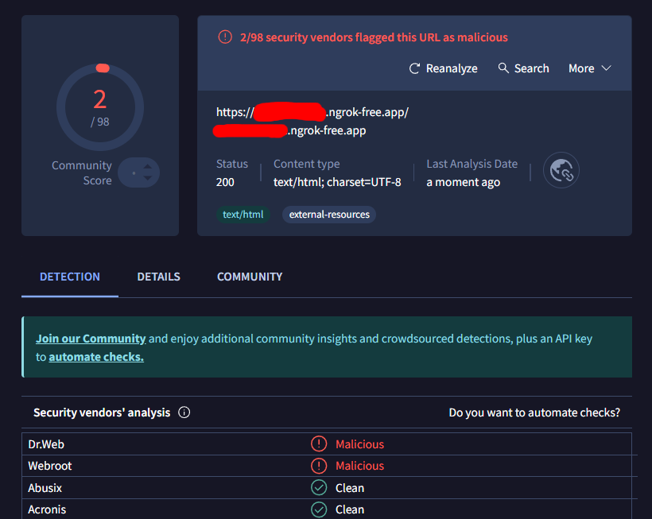
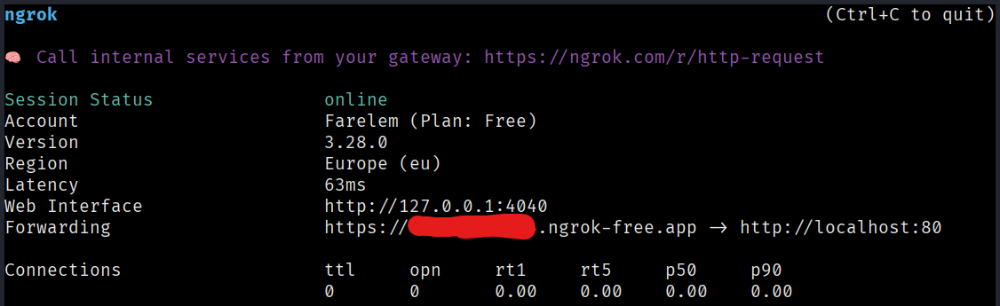
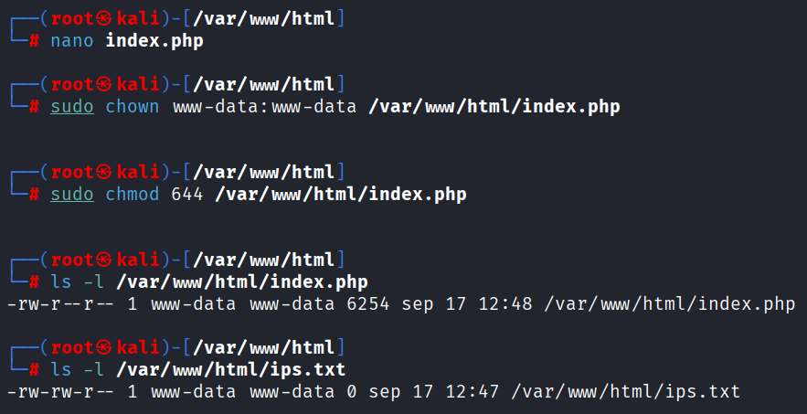
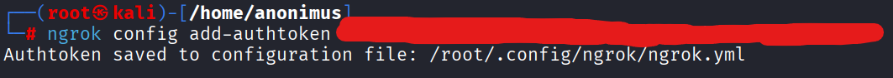
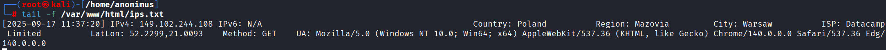
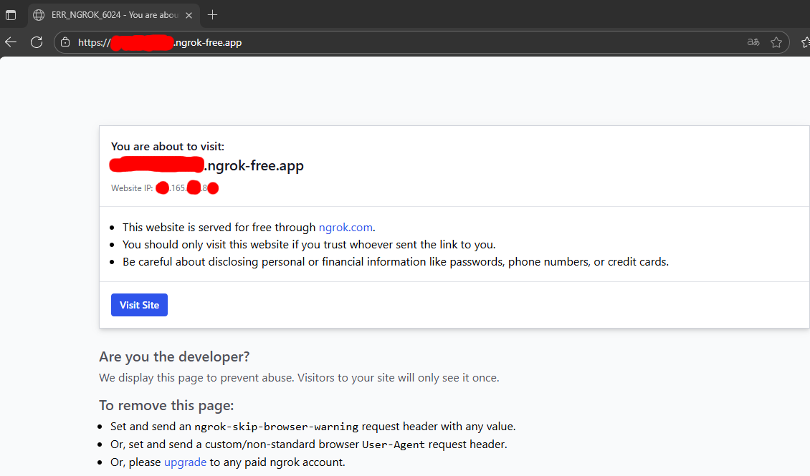
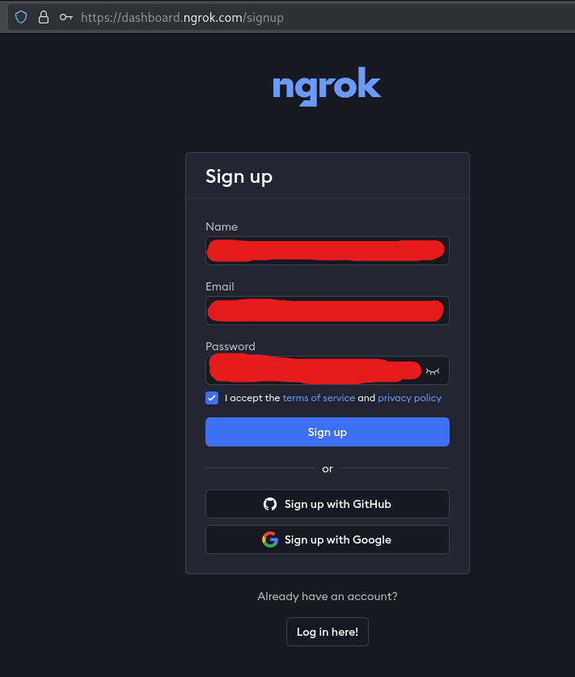

# 🌐 IP Tracker con Redirección Invisible


*Resultado del análisis en VirusTotal - Solo 2/98 motores detectaron como falso positivo*

## 📖 Índice
1. [Descripción del Proyecto](#-descripción-del-proyecto)
2. [Cómo Funciona el Sistema](#-cómo-funciona-el-sistema)
3. [Requisitos del Sistema](#-requisitos-del-sistema)
4. [Instalación y Configuración](#-instalación-y-configuración)
5. [Explicación Técnica del Código PHP](#-explicación-técnica-del-código-php)
6. [Uso del Sistema](#-uso-del-sistema)
7. [Medidas de Seguridad y Anonimato](#-medidas-de-seguridad-y-anonimato)
8. [Consideraciones Legales y Éticas](#-consideraciones-legales-y-éticas)
9. [Solución de Problemas](#-solución-de-problemas)
10. [Estructura del Proyecto](#-estructura-del-proyecto)

## 📌 Descripción del Proyecto

Este proyecto implementa un sistema de seguimiento de IPs avanzado que registra información detallada de los visitantes y los redirige de manera transparente a Google. Está específicamente diseñado para:

- 🔍 **Pruebas de seguridad autorizadas** y ejercicios de concienciación
- 📊 **Análisis de tráfico** en entornos controlados
- 🎓 **Demostraciones educativas** sobre técnicas de tracking web
- ⚠️ **Auditorías de seguridad** con consentimiento explícito

**Importante**: Este sistema debe utilizarse ÚNICAMENTE en entornos controlados y con autorización explícita. El uso no autorizado puede violar leyes de privacidad.

## 🔧 Cómo Funciona el Sistema

El sistema opera mediante un flujo cuidadosamente diseñado:

1. **Generación de Enlace**: Se crea un enlace aparentemente inocente usando Ngrok
2. **Captura de Datos**: Cuando un usuario accede, se registra su información de conexión
3. **Redirección Invisible**: El usuario es redirigido silenciosamente a Google
4. **Protección del Operador**: Todas las operaciones se realizan través de VPN

```
Usuario → Enlace Ngrok → Servidor Local → Registro de Datos → Redirección a Google
```


*Panel de control de Ngrok mostrando la sesión activa y el tunneling*

## ⚙️ Requisitos del Sistema

- **Sistema Operativo**: Linux (Kali/Ubuntu/Debian recomendado)
- **Servidor Web**: Apache con PHP 7.4+
- **Memoria**: Mínimo 512MB RAM
- **Espacio**: 100MB de espacio libre
- **Conexión**: Internet para geolocalización y Ngrok

## 🚀 Instalación y Configuración

### Preparación del Entorno

```bash
# 1. Clonar o descargar los archivos del proyecto
git clone [url-del-repositorio]
cd ip-tracker

# 2. Hacer ejecutable el script de preparación
chmod +x preparacion.sh

# 3. Ejecutar el script (requiere permisos de administrador)
sudo ./preparacion.sh
```

### Qué hace el script de preparación:

El script `preparacion.sh` automatiza completamente la configuración:

1. **Crea backup** del directorio web actual
2. **Limpia** el directorio `/var/www/html` para un entorno fresco
3. **Instala Apache y PHP** si no están presentes
4. **Configura permisos** adecuados para los archivos
5. **Crea el archivo de logs** `ips.txt` con permisos correctos
6. **Reinicia Apache** para aplicar los cambios


*Configuración de permisos para los archivos del proyecto*

### Configuración de Ngrok

```bash
# 1. Descargar e instalar Ngrok
wget https://bin.equinox.io/c/bNyj1mQVY4c/ngrok-v3-stable-linux-amd64.tgz
tar -xzf ngrok-v3-stable-linux-amd64.tgz
sudo mv ngrok /usr/local/bin/

# 2. Autenticarse en Ngrok (necesaria cuenta gratuita)
ngrok config add-authtoken TU_TOKEN_AQUI
```


*Autenticación exitosa en Ngrok con token válido*

```bash
# 3. Exponer el servidor local
ngrok http 80
```

## 💻 Explicación Técnica del Código PHP

El archivo `index.php` es el núcleo del sistema y realiza las siguientes funciones:

### 1. Configuración Inicial
```php
// Zona horaria y IPs a ignorar (para no registrar tus propias pruebas)
date_default_timezone_set('UTC');
$IGNORE_IP = ''; // Ej: "203.0.113.5" para ignorar una IP específica
```

### 2. Sistema de Logs Inteligente
El código intenta múltiples ubicaciones para guardar logs, en orden de preferencia:
- Directorio fuera del web root (más seguro)
- Directorio dentro del web root (accesible)
- Directorio temporal del sistema (último recurso)

### 3. Obtención de la IP del Cliente
Función avanzada que verifica múltiples cabeceras HTTP para determinar la IP real, incluso detrás de proxies o Cloudflare.

### 4. Detección de IPs Privadas
Sistema que identifica y filtra direcciones IP de redes locales:
- Rangos IPv4 privados (10.x.x.x, 172.16.x.x, 192.168.x.x)
- Direcciones IPv6 locales
- Direcciones de loopback

### 5. Geolocalización Avanzada
Integración con ip-api.com para obtener información detallada:
- País, región y ciudad
- Coordenadas geográficas (latitud/longitud)
- Proveedor de servicio de Internet (ISP)

### 6. Registro de Datos Completos
Cada entrada del log incluye:
```php
[2025-09-17 11:37:20] IP: 149.102.244.108 Country: Poland Region: Mazovia City: Warsaw ISP: Datacamp Limited LatLon: 52.2299,21.0093 Method: GET UA: Mozilla/5.0... Accept-Lang: en-US Referer: https://example.com URI: /
```

### 7. Redirección Transparente
Después de registrar todos los datos, el usuario es redirigido inmediatamente a Google sin indicios visibles.

## 📊 Uso del Sistema

### Generación del Enlace de Tracking
Después de ejecutar Ngrok, obtendrás un enlace como:
```
https://abcd1234.ngrok-free.app
```

Este enlace puede ser compartido con los objetivos de la prueba.

### Monitoreo en Tiempo Real
Para ver los accesos en tiempo real:
```bash
tail -f /var/www/html/ips.txt
```

### Ejemplo de Salida del Log
```
[2025-09-17 11:37:20] IP: 149.102.244.108 Country: Poland Region: Mazovia City: Warsaw ISP: Datacamp Limited LatLon: 52.2299,21.0093 Method: GET UA: Mozilla/5.0 (Windows NT 10.0; Win64; x64) AppleWebKit/537.36 Chrome/140.0.0.0 Safari/537.36 Edg/140.0.0.0 Accept-Lang: en-US,en;q=0.9 Referer: https://example.com URI: /
```


*Ejemplo de datos capturados mostrando información detallada del visitante*

## 🛡️ Medidas de Seguridad y Anonimato

### Para el Operador:
- **VPN Obligatoria**: Todas las conexiones deben realizarse through VPN
- **Cuenta Ngrok Desechable**: Usar email temporal para registro
- **Eliminación de Logs**: Borrar periódicamente los datos capturados
- **Servidor Aislado**: Usar máquina virtual o contenedor dedicado

### Para los Sujetos de Prueba:
- **Advertencia de Ngrok**: Los usuarios verán una página de advertencia inicial
- **Redirección Rápida**: Minimiza el tiempo de exposición
- **Sin Almacenamiento Persistente**: No se instala nada en sus dispositivos
- **Solo Datos Públicos**: Se captura únicamente información disponible públicamente


*Página de advertencia que ven los usuarios al acceder al enlace de Ngrok*

## ⚖️ Consideraciones Legales y Éticas

### Uso Aceptable:
- ✅ Pruebas de seguridad con autorización explícita por escrito
- ✅ Ejercicios educativos en entornos controlados
- ✅ Auditorías internas con consentimiento informado
- ✅ Investigación académica con aprobación ética

### Uso Inaceptable:
- ❌ Tracking sin consentimiento
- ❌ Vigilancia no autorizada
- ❌ Actividades maliciosas o fraudulentas
- ❌ Violación de privacidad

### Legislación Applicable:
- GDPR (Protección de datos en Europa)
- CCPA (California Consumer Privacy Act)
- Leyes locales de protección de datos y privacidad

## 🔧 Solución de Problemas

### Error de Permisos
```bash
sudo chown -R www-data:www-data /var/www/html
sudo chmod -R 755 /var/www/html
```

### Ngrok no se conecta
```bash
# Verificar autenticación
ngrok config check

# Verificar que no hay conflictos de puertos
sudo netstat -tulpn | grep :80
```

### No se generan logs
```bash
# Verificar permisos de escritura
sudo touch /var/www/html/ips.txt
sudo chmod 664 /var/www/html/ips.txt

# Verificar que PHP puede escribir
sudo -u www-data touch /var/www/html/test.txt
```

### Geolocalización no funciona
- Verificar conexión a internet del servidor
- Comprobar que ip-api.com está accesible
- Revisar configuración de firewall

## 📁 Estructura del Proyecto

```
ip-tracker/
├── 📄 index.php              # Script principal de tracking
├── ⚙️ preparacion.sh         # Configuración automática del entorno
├── 📊 ips.txt               # Logs generados (no incluido en repo)
└── 📷 capturas/            # Evidencia de funcionamiento
    ├── ngrok-token.png
    ├── analisis-con-virustotal.png
    ├── ngrock-exponiendolo-al-mundo.png
    ├── creacion-y-permisos-de-index-y-txt.png
    ├── victima-accediendo-al-enlace.png
    ├── registro-de-ngrok.png
    ├── victima-capturada.png
    └── aviso-de-ngrok-gratuito.png
```


*Página de registro de Ngrok para crear una cuenta gratuita*

## 📞 Soporte Técnico

Para problemas técnicos:
1. Verificar que todos los requisitos del sistema están cumplidos
2. Revisar los logs de Apache: `/var/log/apache2/error.log`
3. Comprobar que PHP está ejecutándose correctamente
4. Asegurarse de que Ngrok está correctamente autenticado

---

**⚠️ DECLARACIÓN FINAL DE RESPONSABILIDAD**: Este software se proporciona únicamente con fines educativos y de investigación security. El usuario es el único responsable de cumplir con todas las leyes aplicables y obtener el consentimiento necesario antes de su uso. Los desarrolladores no se hacen responsables del uso indebido de esta herramienta.